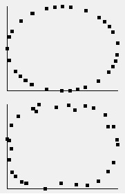

# DSynapse
C-style full connected neural network

## Getting start
Create `DSynapse::net` instanse to start learning with call `DSynapse::alloc_net`

## Terms
```
input - input array of sample. Size of this array equal to first layer size
output - net output array. Size of this array equal to last layer size
target - target array of sample (net will learn approximate this array). Size of this array equal to output
```
## Prepare to learning

Before learning you need tune your net
#### Set activation function

`DSynapse::ACTIVATION` enumeration contain labels for activation functions in DSynapse:
```
enum ACTIVATION
{
    ACT_SIGMOID
    ,ACT_GTAN
    ,ACT_RELU
    ,ACT_LEAKYRELU
    ,ACT_GELU
    ,ACT_ELU
    ,ACT_LINE
    ,ACT_EMPTY
    ,ACT_DEBUG
};
```
- Pick `ACT_SIGMOID` if input and output values can be normalized in range [ 0.0 : 1.0 ] 
- Pick `ACT_GTAN` if input and output values can be normalized in range [ -1.0 : 1.0 ]
- Pick `ACT_RELU` if input and output values can be normalized in range [ 0.0 : inf ] (For example I used `ACT_RELU` to approx `y = x^2` )
- `ACT_LEAKYRELU`, `ACT_GELU` and `ACT_ELU` untested.
- `ACT_LINE` and `ACT_EMPTY` does not change value 
- `ACT_DEBUG` can contain debug code

To set actiovation function call `DSynapse::net_set_actf(NET_P n, ACTIVATION a)` where `n` is your net and `a` activation function label.
> Also you can choose different activation functions for different layers

#### Set back propagation method

`DSynapse::BACKPROP_FUNCTION` enumeration contain labels for back propagation functions in DSynapse:
```
enum BACKPROP_FUNCTION
{
    BP_DEFAULT
    ,BP_MOMENTUM
    ,BP_NESTEROV
    ,BP_ADAGRAD
    ,BP_RMSPROP
    ,BP_ADAM1
    ,BP_ADAM2
};
```
To set actiovation function call `DSynapse::net_set_bpf(NET_P n, BACKPROP_FUNCTION bpf)` where `n` is your net and `bpf` back propagation function label.

#### Set random weights

Use `DSynapse::net_set_randw(NET_P n)` to set ranmon weights or use `DSynapse::net_set_opt_randw(NET_P n)` to set random weights in optimazed range.
Also you can set global callbacks for generate rangdom values:
```
void DSynapseSetRandCallback(rand_callback c);
void DSynapseSetRangedRandCallback(ranged_rand_callback c);
```

#### Set learn rate
Use `DSynapse::net_set_lr(NET_P n, nvt lr)`

#### Set qrate
If need you can set input and output qrate
- Input qrates will be use to divide all inputs to this values
- Output qrates will be use to divide target to this values
```
int net_set_input_qrate(NET_P n, data_line input);
int net_set_output_qrate(NET_P n, data_line output);
int net_fill_input_qrate(NET_P n, nvt qr);
int net_fill_output_qrate(NET_P n, nvt qr);
```
#### Set epocs
Use `int net_set_epoc_size(NET_P n, int esize)` to set epocs number

#### Set loss function
Loss function should calculate error between `target` and `output` and total error of net.
```
typedef int (*LOSS_FUNCTION_CALLBACK)(
            const_data_line out
        ,   const_data_line target
        ,   data_line out_error
        ,   nvt *total_error
        ,   int size
        );
```
Use `int net_set_loss_function(NET_P n, LOSS_FUNCTION_CALLBACK lf)` to set loss function callback. 

DSynapse provide loss functions:
```
int loss_function_default(const_data_line out, const_data_line target, data_line out_error, nvt *total_error, int size);
int loss_function_quadratic(const_data_line out, const_data_line target, data_line out_error, nvt *total_error, int size);
int loss_function_cross_entropy(const_data_line out, const_data_line target, data_line out_error, nvt *total_error, int size);
```

#### Set learn data source callbacks

Use one of this function to set learning dataset:
```
int net_set_default_load(NET_P n, data_line input, data_line target);
int net_set_custom_load(NET_P n, LOAD_SAMPLE_CALLBACK callback, const void *data);
int net_set_global_load(NET_P n, LOAD_SAMPLE_CALLBACK callback);
```
- Call `net_set_default_load` if in your dataset input and target samples placed in C-style array lineary. Just set this arrays to argument `input` and `target`.
- Call `net_set_global_load` if your dataset samples will generated by callback
- Call `net_set_custom_load` if your dataset samples will generated by callback and this callback need some source data.

## Learning

### Keep tuning
#### Late delta flushing 
You can tune frequency of flushing of weights deltas. In default case this frequency equal `1` and this mean 
each backpropagation will add calculated deltas to weight matrix. Increas this frequency to acummulate deltas in separate matrix
to flush it skipping n back propagations.
Use `int net_use_delta_buffers(NET_P n, LAYER_DELTA_BUFFERS s)` and `int net_set_lateflush_freq(NET_P n, int size)`.

#### Packets
You can tune packet size for learning. By default packet size equal `1` and this mean packet is sample. But with packet size more than `1`
each packet will contain several samples. While learning net does one back propagation for one packet. If you has packet size is 5 - net will
does 5 forward propagations and 1 back propagation each 5 samples or each packet.

> (Interface and code temporarry unavailable)

#### Multinet learning

Multinet is a set of nets with same parameters and single common weight matrix. Each subnet lerning on different samples and accumulate thier deltas 
in own delta matrix. In settings depended time all this deltas add to weight matrix.

> (Interface and code temporarry unavailable)

#### Ensembles
Ensembles trick looks like multinet but with important difference. Each subnet has own weight matrix with different start values and each subnet
learning separate of each other on same full dataset. Only after all subnets will learned - their weight matrix are averaged to make single weight matrix.

> (Interface and code temporarry unavailable)

#### Dropout
Dropout is technique to disable some neurons with `dropout rate` chance. Net learned with dropout should change forward propagation behaivor after learning (in work mode):
```
enum DROPOUT
{
    DROPOUT_NO
    ,DROPOUT_FW
    ,DROPOUT_IV
};
```
- `DROPOUT_FW` is forward dropout
- `DROPOUT_IV` is inverted dropout
To compensate dropout learning...

> (Interface and code temporarry unavailable)

#### Batch normalization
Choose layer wich will use batch normalization. This normalization will apply to each packet in learning dataset.

> (Interface and code temporarry unavailable)

#### L1 regularization
In plan

> (Interface and code temporarry unavailable)

## Examples:

Classification task (black points to red space, white to blue):


Function approximation:

> Top image - simple sircle, bot image - net approximation



